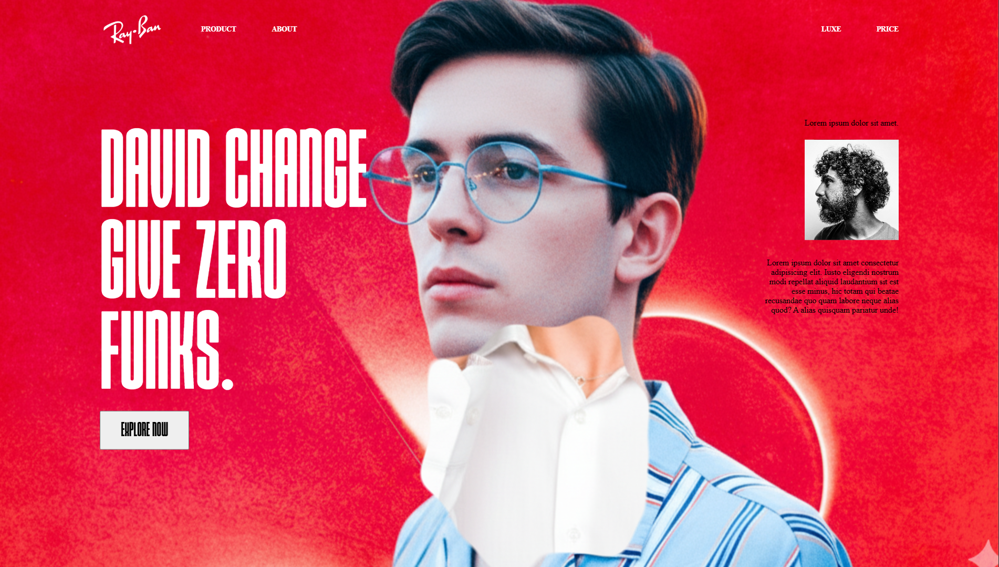

# Project Title

A brief description of what this project does and who it's for

# 🕶️ RayBan

A modern **fashion-inspired landing page** built using only **HTML** and **CSS**.  
This project focuses on **bold typography**, **creative image layering**, and a **visually striking hero section**.  
(Note: This version is **not responsive** yet — optimized for desktop screens.)

---

## 📸 Preview

  
*(Replace this with your actual screenshot file name)*

---

## ✨ Features

- Elegant hero section with layered visual effects  
- Stylish and clean typography design  
- Smooth button hover interaction  
- Gradient background for modern aesthetics  
- Minimal and easy-to-read HTML/CSS code  

---

## 🛠️ Technologies Used

- **HTML5**  
- **CSS3 (Flexbox / Grid)**  

---

## 🚀 Getting Started

To view this project locally:

1. **Clone the repository**
   ```bash
   git clone https://github.com/VISHALVARUN011002/Rayban.git


